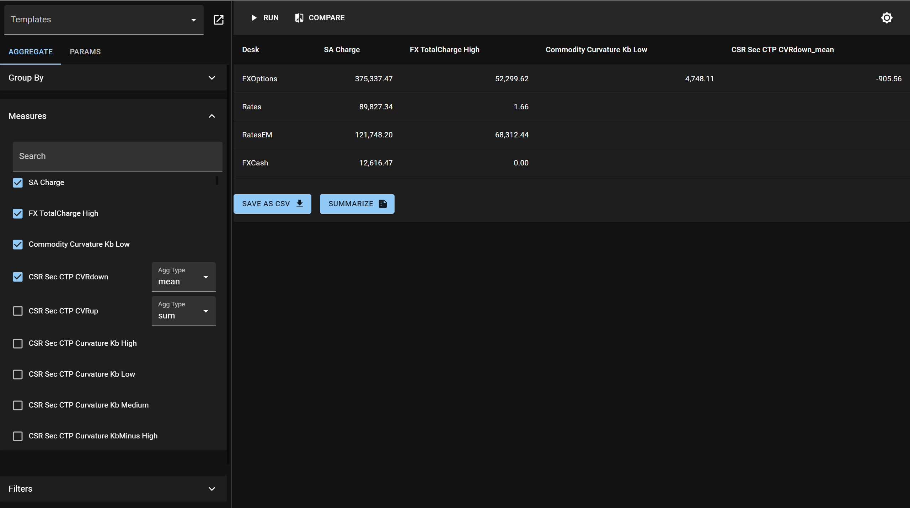

# UI

Everything discussed in [Calculation](./calculation/calc_intro.md) chapter can be done via a UI. **`ultibi's`** provides a user friendly interface of your dataset and allows you to perform analysis live - without need to write any further code.



To achieve this simply call **`.ui()`** method on your dataset:

```python
{{#include ./examples/ui.py}}
ds.ui()
```
